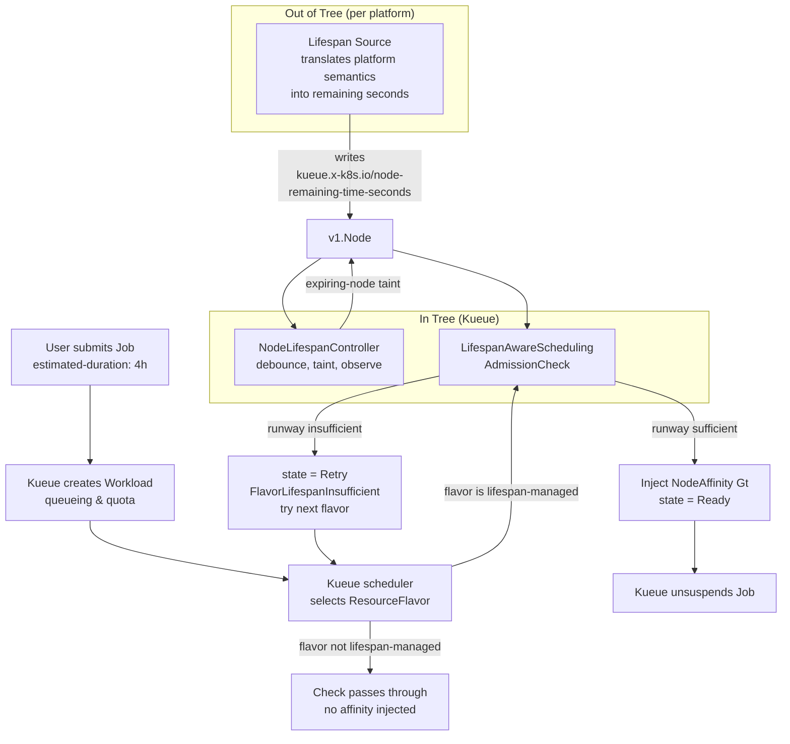

# KEP-15200: Lifespan Aware Scheduling

<!-- toc -->
- [Summary](#summary)
- [Motivation](#motivation)
  - [The Blind Spot in Batch Scheduling](#the-blind-spot-in-batch-scheduling)
  - [Classes of Time-Bounded Capacity](#classes-of-time-bounded-capacity)
  - [Production Evidence &amp; Failure Modes](#production-evidence--failure-modes)
  - [Goals](#goals)
  - [Non-Goals](#non-goals)
- [Proposal](#proposal)
  - [Architecture Overview](#architecture-overview)
  - [Scope Boundary: Generic Code, Platform-Specific Configuration](#scope-boundary-generic-code-platform-specific-configuration)
  - [User Stories](#user-stories)
    - [Story 1: Scale-from-Zero on Leased Capacity](#story-1-scale-from-zero-on-leased-capacity)
    - [Story 2: Packing Multiple Short Batch Jobs onto Aging Nodes](#story-2-packing-multiple-short-batch-jobs-onto-aging-nodes)
    - [Story 3: Multi-Flavor Fungibility &amp; Fallback to Durable Capacity](#story-3-multi-flavor-fungibility--fallback-to-durable-capacity)
    - [Story 4: Autonomous Duration Inference via Webhook](#story-4-autonomous-duration-inference-via-webhook)
    - [Story 5: Draining Ahead of Planned Maintenance](#story-5-draining-ahead-of-planned-maintenance)
  - [Notes/Constraints/Caveats](#notesconstraintscaveats)
  - [Risks and Mitigations](#risks-and-mitigations)
- [Design Details](#design-details)
  - [System Components &amp; Separation of Concerns](#system-components--separation-of-concerns)
    - [1. Lifespan Source (In-Tree, Configurable)](#1-lifespan-source-in-tree-configurable)
    - [2. NodeLifespanController (In-Tree State Producer)](#2-nodelifespancontroller-in-tree-state-producer)
    - [3. LifespanAwareScheduling AdmissionCheck (State Consumer)](#3-lifespanawarescheduling-admissioncheck-state-consumer)
  - [The Lifespan Source Contract](#the-lifespan-source-contract)
    - [Producer Requirements](#producer-requirements)
    - [Consumer Guarantees](#consumer-guarantees)
    - [Handling Nodes Without a Lifespan Signal](#handling-nodes-without-a-lifespan-signal)
  - [API Specifications](#api-specifications)
    - [NodeLifespanConfig CRD (apis/kueue/v1alpha1)](#nodelifespanconfig-crd-apiskueuev1alpha1)
    - [LifespanPolicy CRD (apis/kueue/v1alpha1)](#lifespanpolicy-crd-apiskueuev1alpha1)
    - [AdmissionCheck Declaration &amp; Parameters Reference](#admissioncheck-declaration--parameters-reference)
    - [ClusterQueue AdmissionChecksStrategy Integration](#clusterqueue-admissionchecksstrategy-integration)
    - [Upstream PodSetUpdate Extension in Kueue Core](#upstream-podsetupdate-extension-in-kueue-core)
    - [Standard Label and Taint Taxonomy](#standard-label-and-taint-taxonomy)
  - [Etcd Protection &amp; Adaptive Debouncing Engine](#etcd-protection--adaptive-debouncing-engine)
    - [Mathematical Proof of Write Reduction](#mathematical-proof-of-write-reduction)
    - [Stale Label Race Condition Mitigation](#stale-label-race-condition-mitigation)
    - [Safety Floors &amp; Zero-Taint Enforcement](#safety-floors--zero-taint-enforcement)
  - [AdmissionCheck Algorithm &amp; Latency Budget](#admissioncheck-algorithm--latency-budget)
  - [Queueing, Requeuing &amp; Inadmissibility Interactions](#queueing-requeuing--inadmissibility-interactions)
  - [Preemption, Cohorts &amp; Fair Sharing Co-existence](#preemption-cohorts--fair-sharing-co-existence)
  - [Observability, Metrics &amp; Events](#observability-metrics--events)
    - [Prometheus Metrics](#prometheus-metrics)
    - [Workload Conditions &amp; Events](#workload-conditions--events)
  - [Test Plan](#test-plan)
    - [Prerequisite testing updates](#prerequisite-testing-updates)
    - [Unit Tests](#unit-tests)
    - [Integration Tests](#integration-tests)
    - [End-to-End Tests](#end-to-end-tests)
  - [Graduation Criteria](#graduation-criteria)
    - [Alpha (v0.21)](#alpha-v021)
    - [Beta (v0.22)](#beta-v022)
    - [Stable (v0.24)](#stable-v024)
- [Implementation History](#implementation-history)
- [Drawbacks](#drawbacks)
- [Alternatives Considered](#alternatives-considered)
  - [Alternative 1: Pure kube-scheduler Node Filtering / Scoring Plugin](#alternative-1-pure-kube-scheduler-node-filtering--scoring-plugin)
  - [Alternative 2: Cluster Autoscaler-Only Time Horizon Management](#alternative-2-cluster-autoscaler-only-time-horizon-management)
  - [Alternative 3: Enforcing Termination via Workload ActiveDeadlineSeconds](#alternative-3-enforcing-termination-via-workload-activedeadlineseconds)
  - [Alternative 4: Direct Node Polling Inside the AdmissionCheck](#alternative-4-direct-node-polling-inside-the-admissioncheck)
  - [Alternative 5: Reusing workload.spec.maximumExecutionTimeSeconds for Node Placement](#alternative-5-reusing-workloadspecmaximumexecutiontimeseconds-for-node-placement)
  - [Alternative 6: In-Tree Provider-Specific Adapters](#alternative-6-in-tree-provider-specific-adapters)
  - [Alternative 7: Out-of-Tree Source Controllers per Platform](#alternative-7-out-of-tree-source-controllers-per-platform)
<!-- /toc -->

## Summary

Modern AI/ML infrastructure increasingly provides compute capacity governed by a finite, **discoverable** operational lifespan. The node exists now, it is healthy now, and it will be taken away at a time that is already known.

Standard Kubernetes `kube-scheduler` is temporally blind. It evaluates resource capacity (CPU, memory, accelerators) at a single instant, without asking whether a candidate node's *remaining* operational lifetime can accommodate the work being placed on it. When a long-running batch job lands on an aging node, the underlying machine is reclaimed mid-run. This triggers uncheckpointed computation loss, wasted accelerator hours, and elevated operational toil.

This KEP introduces **Lifespan Aware Scheduling (LAS)** into Kueue. Lifespan is treated as a first-class scheduling dimension, alongside topology (KEP-2724). The proposal consists of:

- A vendor-neutral node label, `kueue.x-k8s.io/node-remaining-time-seconds`, as the **single currency** for remaining operational time;
- An in-tree **`NodeLifespanController`** that consumes that label, applies adaptive etcd debouncing, and taints nodes approaching reclamation;
- A **`LifespanAwareScheduling` AdmissionCheck** that evaluates estimated workload execution duration against available node lifespan with a configurable safety buffer; and
- An upstream extension to Kueue's **`PodSetUpdate`** API to support injecting `NodeAffinity` requirements (`Gt` expressions) into admitted pods.

Kueue thereby ensures workloads land exclusively on nodes that will survive their execution window, while enabling multi-flavor fungibility: falling back to durable capacity when leased nodes cannot satisfy the required runway.

Crucially, **Kueue itself never talks to a cloud provider.** Translating any specific platform's capacity semantics into the neutral label is the job of an out-of-tree *lifespan source*. See [Scope Boundary](#scope-boundary-in-tree-consumer-out-of-tree-sources).

---

## Motivation

### The Blind Spot in Batch Scheduling

A growing share of accelerator capacity is offered on terms that trade permanence for price or availability. The operator accepts that the machine will disappear at a known time; in return they get a discount, or they get capacity that is otherwise unobtainable.

Because nodes remain active across sequential batch runs, and are reused after earlier tasks complete, a node's remaining operational lifetime **decreases monotonically**. A node pool that was provisioned with a 24-hour lease is, 23 hours later, a pool of nodes with one hour left. Nothing in the Kubernetes scheduling path represents this.

The resulting failure is mundane and repetitive:

- A 6-hour fine-tuning job lands on a node with 45 minutes of remaining lease.
- At expiry, the infrastructure forcefully reclaims the machine (ungraceful shutdown / `SIGKILL`).
- If the training framework lacks frequent checkpointing, hours of compute are discarded.
- Operators respond by either setting aggressive autoscaler idle timeouts — scaling pools to zero after every job and paying a cold-boot penalty on every submission — or by abandoning time-bounded capacity entirely for anything longer than a few hours.

Both responses destroy the economic case for the capacity in the first place.

### Classes of Time-Bounded Capacity

This KEP deliberately does not enumerate vendor products. It targets an abstract property: **a node whose remaining lifespan is finite and knowable in advance.** Capacity exhibiting this property includes, but is not limited to:

| Class | Shape of the bound | Typical origin |
|---|---|---|
| **Time-limited leases** | Relative: node is reclaimed a fixed duration after creation | Discounted capacity tiers that cap maximum run duration |
| **Planned maintenance evacuation** | Absolute: node must be vacated before a disruption horizon | Host maintenance, kernel upgrades, fleet-wide remediation |
| **Node max-age policies** | Relative: node retired after a fixed age | Operator compliance policy, image-freshness requirements |
| **Cohort lending returns** | Absolute: borrowed capacity due back at a known time | Inter-team or inter-cluster capacity lending agreements |
| **Notice-based reclamation** | Absolute but short: node reclaimed after a brief notice | Interruptible / preemptible capacity tiers |
| **Fixed-window reservations** *(deferred)* | Absolute and **uniform**: all nodes expire at the same instant | Capacity reserved between a scheduled start and end |

The first four produce per-node bounds that vary across the flavor, which is what this proposal addresses. Notice-based reclamation is included for completeness but yields a runway too short to plan around; LAS will honour it if a source publishes it, but the value is concentrated in the longer-lived classes.

Fixed-window reservations are deliberately deferred. Because every node expires simultaneously, there is nothing to discriminate between — the per-node machinery proposed here would write an identical value to every node and then filter on it, which is pure overhead. That class is better served by a flavor-level deadline and is called out in [Non-Goals](#non-goals).

What matters to Kueue is only this: some component can answer the question *"how many seconds does this node have left?"*

### Production Evidence & Failure Modes

In large-scale AI/ML batch clusters running on time-bounded capacity, node lease expiry is a primary cause of job interruption:

- When nodes are reused across sequential batch runs, remaining operational time steadily declines, and the probability that the next job outlives the node rises with every reuse.
- Without duration-aware placement, long jobs land on nodes with insufficient remaining lease and are killed mid-epoch.
- For multi-node distributed training (e.g. PyTorch DDP/FSDP), failure probability scales with node count: a single node reaching its boundary terminates the entire gang and discards all uncheckpointed progress.
- Fleet operators are pushed toward the two bad workarounds above, each of which forfeits most of the benefit of the capacity tier.

### Goals

1. **Vendor-Neutral Lifespan Tracking:** Establish `kueue.x-k8s.io/node-remaining-time-seconds` as the single, standard representation of remaining node lifespan, with a documented contract for out-of-tree producers, and consume it without write amplification to etcd.
2. **AdmissionCheck per ResourceFlavor:** Extend Kueue's AdmissionCheck mechanism (KEP-1432) to evaluate workload duration against lifespan-managed flavors via `onFlavors`.
3. **Safety Buffer Calculus:** Support a configurable operational safety buffer to absorb image pull time, initialization latency, and graceful checkpoint drain before reclamation.
4. **Node Affinity Injection via PodSetUpdate:** Allow AdmissionCheck controllers to inject `corev1.NodeAffinity` (using `corev1.NodeSelectorOpGt`) via `workload.status.admissionChecks[].podSetUpdates` across all `NodeSelectorTerms`, so that `kube-scheduler` enforces placement on eligible nodes.
5. **Multi-Flavor Fungibility:** Automatically trigger flavor fallback when a workload exceeds the remaining lifespan available in a leased flavor.
6. **Zero-Touch Autonomy:** Support duration ingestion from mutating webhooks and platform estimators, without requiring researchers to hand-edit YAML.
7. **Strict In-Tree Vendor Neutrality:** Ship no provider-specific code in Kueue. Every platform integration is an out-of-tree lifespan source.

### Non-Goals

1. **Modifying the Kubernetes Core Scheduler:** This KEP does not alter `kube-scheduler` filtering or scoring code. Placement is directed strictly through standard `NodeAffinity` requirements.
2. **Replacing Kubelet Eviction:** This KEP does not alter kubelet graceful node shutdown or `SIGTERM` handling.
3. **Workload Completion Deadlines / SLOs:** LAS constrains placement using a bound imposed by the *infrastructure*. It deliberately does not model a bound imposed by the *user* — "this job must finish by 09:00" — which is a property of the Workload, not of the node, and which actuates through queue ordering and urgency rather than node filtering. Such a feature is expected to be proposed separately (working title: *Workload Deadlines*). To keep that door open, this KEP does not claim the term "deadline" anywhere in its API surface, and the duration-estimate annotation is deliberately specified as a shared, LAS-independent contract.
4. **Guaranteeing Execution Deadlines (Hard Enforcement):** Enforcing cumulative job runtime across the workload lifecycle is owned by KEP-3125 (`maximumExecutionTimeSeconds`). This KEP guarantees *per-attempt placement eligibility at admission time*. Because `spec.maximumExecutionTimeSeconds` accumulates across eviction/restart cycles (via `status.accumulatedPastExecutionTimeSeconds`) and does not reset on retry, it cannot serve as a proxy for the single-attempt continuous runway an ephemeral node requires. See [Alternative 5](#alternative-5-reusing-workloadspecmaximumexecutiontimeseconds-for-node-placement).
5. **Producing Duration Estimates:** LAS *consumes* an estimate. Producing one — whether by static annotation, historical inference, or a mutating webhook — is explicitly out of scope.
6. **Autoscaler Implementation:** This KEP does not manage cloud VM provisioning API calls, which remain the domain of Cluster Autoscaler or Karpenter.
7. **Cloud Provider Integration:** No provider-specific labels, APIs, or credentials are read by Kueue. See [Alternative 6](#alternative-6-in-tree-provider-adapters).
8. **Uniform (Flavor-Level) Lifespan:** Some capacity classes expire *uniformly* — every node in the pool reaches its boundary at the same absolute instant, with no per-node variance and no erosion through reuse. Such capacity is better modelled by a single deadline attached to the `ResourceFlavor` than by per-node labels, and requires neither debouncing nor node-affinity injection. This shape is explicitly out of scope for alpha: the per-node model proposed here does not preclude it, and it can be added later as an additional mode behind the same AdmissionCheck. The initial implementation targets capacity whose nodes age independently.

---

## Proposal

### Architecture Overview

The system uses a decoupled architecture that cleanly separates platform translation, node-level horizon tracking, and workload-level admission decisions.



The admission decision reduces to a single inequality. For a workload with estimated duration $T_{\text{est}}$ on a node with remaining lifespan $T_{\text{node}}$:

$$T_{\text{node}} \ge T_{\text{required}} = T_{\text{est}} + T_{\text{buffer}} + \Delta_{\text{debounce}}$$

### Scope Boundary: Generic Code, Platform-Specific Configuration

This is the central architectural commitment of the KEP, and the reason it is proposable upstream at all.

The obvious way to support a platform is to write an adapter for it. That is what this KEP does **not** do. Kueue ships **one generic source implementation** whose behaviour is entirely determined by operator-supplied configuration. Platform specificity lives in YAML, not in the binary.

| | In-Tree (this KEP) | Supplied by the operator |
|---|---|---|
| **Ships** | A generic source that reads a value from node metadata and interprets it | A `NodeLifespanConfig` describing where the value lives and how it is encoded |
| **Knows about** | Labels, annotations, timestamps, durations, seconds | Which label their platform uses, and what it means |
| **Credentials** | None beyond the cluster | None |
| **Outbound calls** | None | None |

Kueue contains no conditional logic keyed on a cloud provider, no provider SDK dependency, and no code path that issues an outbound call to a provider API. Adding support for a new platform requires no Kueue release, no new module, and no code at all.

A source declares four things: which nodes it applies to (a standard `metav1.LabelSelector`), where the value lives (`from.label` or `from.annotation`), whether that value is an absolute instant or a duration measured from `creationTimestamp` (`mode`), and how it is encoded (`format`). That is sufficient to express every time-bounded capacity product the authors are aware of.

**Why this is a stronger guarantee than out-of-tree modules.** An earlier draft of this KEP proposed that every platform ship its own source controller. Configuration is better on every axis that matters: there is nothing to release separately, nothing to version-skew against Kueue, nothing to keep in sync, and no place for provider-specific logic to accumulate. It is also *testable* in a way an out-of-tree ecosystem is not — the same code path serves every platform, so it is exercised by every user.

It also enforces the boundary structurally rather than by convention. A platform whose deadline is only retrievable through an API call **cannot** be expressed as configuration, and therefore cannot be added without an explicit, reviewable change to this design. Capacity products of that shape are out of scope for alpha (see Non-Goal 8), and the configuration model makes that boundary impossible to erode by accident.

**The escape hatch.** The `Source` interface remains exported. Logic that configuration genuinely cannot express may be supplied out of tree, subject to the same contract. This is expected to be rare, and implementations must still never call a provider API on the admission path.

**Multiple sources.** Several sources may apply to the same node — a node may be simultaneously subject to a lease and to a maintenance appointment. The effective lifespan is the **minimum** across all applicable sources, because a node cannot outlive the first of its deadlines. The binding source is recorded on the node as a diagnostic annotation.

### User Stories

#### Story 1: Scale-from-Zero on Leased Capacity

As an ML platform engineer, I configure a ClusterQueue with a flavor `leased-gpu` backed by a time-limited node pool. A user submits an 8-hour fine-tuning Job. Kueue admits the workload; Cluster Autoscaler provisions a fresh node with a 24-hour lease. The lifespan source stamps `kueue.x-k8s.io/node-remaining-time-seconds: "86400"`. The AdmissionCheck evaluates:

$$T_{\text{required}} = 8\text{h} + 30\text{m}\ (\text{buffer}) + 5\text{m}\ (\text{debounce}) = 30{,}900\text{s} \le 86{,}400\text{s}$$

The check injects node affinity, marks itself `Ready=True`, and Kueue unsuspends the Job.

#### Story 2: Packing Multiple Short Batch Jobs onto Aging Nodes

As a researcher running 20-minute evaluation tasks, I submit jobs to a cluster where a leased node has been running for 23 hours (3,600s remaining). The AdmissionCheck evaluates:

$$T_{\text{required}} = 20\text{m} + 15\text{m} + 5\text{m} = 2{,}400\text{s} \le 3{,}600\text{s}$$

Kueue admits the job onto the live node. A second 20-minute job is admitted alongside it. Both complete safely, maximising utilisation of capacity that would otherwise have been left idle or scaled away.

#### Story 3: Multi-Flavor Fungibility & Fallback to Durable Capacity

As a researcher, I submit a 60-minute training job to a cluster where the only available leased node has 3,600s remaining. The check calculates:

$$T_{\text{required}} = 60\text{m} + 15\text{m} + 5\text{m} = 4{,}800\text{s} > 3{,}600\text{s}$$

Rather than placing the job and suffering a mid-run eviction, the AdmissionCheck sets `State: Retry` with reason `FlavorLifespanInsufficient`. Kueue's multi-flavor engine immediately evaluates the next flavor in the ClusterQueue (`on-demand-gpu`). The job is admitted on durable capacity and completes without human intervention.

#### Story 4: Autonomous Duration Inference via Webhook

As an AI researcher, I submit vanilla Kubernetes Jobs without annotating duration. A mutating admission webhook provided by my platform team inspects the job specification and injects `kueue.x-k8s.io/estimated-duration: "2h"`. Kueue admits the job using the inferred duration. The estimator is entirely external to Kueue; LAS neither knows nor cares how the number was derived.

#### Story 5: Draining Ahead of Planned Maintenance

As a cluster operator, I must vacate a set of nodes before a maintenance window opens in six hours. A lifespan source translates the maintenance horizon into remaining seconds on each affected node. LAS immediately stops admitting work that would not finish in time, while continuing to admit short jobs that will. Nodes quiesce naturally as running work completes, instead of requiring a disruptive forced drain.

### Notes/Constraints/Caveats

- **Autoscaler Contract:** For scale-from-zero, the autoscaler must reproduce the lifespan label on synthesized node templates, or the nodeSelector injected by LAS will prevent scale-up from being triggered. Sources targeting autoscaled pools must verify this; it is a common and subtle failure mode.
- **Clock Skew:** All evaluation uses UTC and is performed centrally against the API server's clock reference, so worker-node clock skew does not affect correctness. Sources publishing *relative* seconds must recompute against a trusted clock, not a node-local one.
- **Graceful Termination Window:** The safety buffer must exceed the platform's pre-termination notice period. Where the platform provides no notice at all — a hard kill at expiry — the buffer must instead cover the full checkpoint-and-drain cost of the workload.
- **Label Value Domain:** `Gt` node affinity compares integers lexicographically-safe only because the value is a plain base-10 integer string with no unit suffix, sign, or padding. The contract fixes this representation.

### Risks and Mitigations

| Risk | Severity | Mitigation Strategy |
|---|---|---|
| **Job Exceeds Estimated Duration** | Medium | The configurable safety buffer absorbs runtime variance, image pull delay, and drain. If a job still overruns, it continues until the node's hard boundary; at that point the platform reclaims the node as it would have anyway. LAS never makes this case *worse* than the status quo. Operators wanting hard termination can pair LAS with KEP-3125. |
| **Etcd Write Amplification & Stale Label Race** | High | Naive per-second updates across 1,000 nodes would overwhelm etcd. The controller employs discrete bucketed debouncing, reducing write frequency by **99.66%**. To close the resulting staleness window, the AdmissionCheck adds $\Delta_{\text{debounce}} = 300\text{s}$ to the required runway. |
| **Missing or Unreliable Lifespan Signal** | High | A node in a lifespan-managed flavor with no label is **fail-closed**: ineligible, counted in `kueue_lifespan_unlabeled_nodes`, and surfaced as an event. The harder half of this risk is the operator deciding what absence *means*, since some platforms use the same absent label for "implicitly bounded" and for "genuinely unbounded". `defaultWhenAbsent` covers the former; the latter belongs in a separate flavor. See [Handling Nodes Without a Lifespan Signal](#handling-nodes-without-a-lifespan-signal). |
| **Admission Check Latency Penalty** | Medium | Evaluation is in-memory over cached node labels. Complexity is $O(1)$ per workload-flavor pair, completing in $<1$ millisecond. |
| **Misconfigured Workload Annotations** | Low | Deterministic fallback policies (`AllowWithDefault`, `StrictReject`) govern unannotated workloads. |
| **Misconfigured Lifespan Source** | Medium | Configuration is now the integration surface, so configuration errors are integration errors. Sources are validated at startup — unknown formats, incompatible mode/format pairs, duplicate names, and encodings that cannot appear in a label value are all rejected before the controller runs, rather than presenting as a source that silently matches nothing. |
| **Source/Consumer Version Skew** | Medium | The contract is a single stable label with a fixed representation. Sources and Kueue may be upgraded independently; the consumer tolerates unparseable values by treating the node as unlabeled and emitting a metric. |

---

## Design Details

### System Components & Separation of Concerns

#### 1. Lifespan Source (In-Tree, Configurable)

Answers one question: *"how many seconds does this node have left?"*

Kueue ships a single generic implementation. Its behaviour comes entirely from a `LifespanSource` entry in `NodeLifespanConfig`, which names the nodes it applies to, where on those nodes the value lives, whether that value is an absolute instant or a duration from `creationTimestamp`, and how it is encoded. It contains no provider-specific logic and makes no outbound calls.

Configuration is validated once, at startup. A source that cannot be interpreted — an unknown format, a mode and format that cannot be combined, a duplicate name — fails the process rather than silently producing a controller that labels nothing.

The `Source` interface is exported so that logic configuration cannot express may be supplied out of tree, subject to [The Lifespan Source Contract](#the-lifespan-source-contract).

#### 2. NodeLifespanController (In-Tree State Producer)

Watches `v1.Node`, runs the configured sources against each one, and publishes the result:

- Reduces across all applicable sources by taking the **minimum**, and records the binding source as a diagnostic annotation.
- Publishes `kueue.x-k8s.io/node-remaining-time-seconds`, applying **adaptive bucketed debouncing** to protect etcd: $\Delta_{\text{debounce}} = 300\text{s}$ normally, narrowing to 60s once a node falls inside the safety floor, where staleness stops being harmless. Expiry is published immediately regardless.
- Removes the label from a node no source speaks about any more, so a deadline cannot outlive the source that produced it.
- Applies the taint `kueue.x-k8s.io/expiring-node:NoSchedule` when remaining lifespan drops below `expiringTaintThreshold` (default 15m), and removes it if lifespan recovers.
- Exposes `kueue_node_remaining_lifespan_seconds` for observability.

#### 3. LifespanAwareScheduling AdmissionCheck (State Consumer)

Integrates natively into Kueue:

- Subscribes to `Workload` objects in ClusterQueues referencing the `lifespan-aware-scheduling` AdmissionCheck.
- Cross-references `ClusterQueue.spec.admissionChecksStrategy.admissionChecks[].onFlavors` (KEP-1432) to determine whether the assigned flavor is lifespan-managed.
- Extracts workload duration from `kueue.x-k8s.io/estimated-duration` and computes:
  $$T_{\text{required}} = T_{\text{est}} + T_{\text{buffer}} + \Delta_{\text{debounce}}$$
- Enforces a minimum window: $\max(T_{\text{required}},\ \text{spec.minimumWindow})$.
- For multi-node gang workloads requesting $K$ nodes, verifies that at least $K$ nodes satisfy $T_{\text{required}}$ before reporting `Ready`. Admitting a gang when only $K-1$ nodes qualify would guarantee the failure the feature exists to prevent.
- Emits a `PodSetUpdate` containing `corev1.NodeAffinity` with a `Gt` requirement, or sets state `Retry` with reason `FlavorLifespanInsufficient` to trigger fallback.

### The Lifespan Source Contract

This section is normative. It is the entire interface between Kueue and any platform.

#### Producer Requirements

A lifespan source **MUST**:

1. Publish the label `kueue.x-k8s.io/node-remaining-time-seconds` on every node it manages, whose value is a **non-negative base-10 integer** denoting whole seconds of remaining operational life, with no unit suffix, sign, or zero-padding.
2. **Publish a bound wherever one genuinely exists, including implicit ones.** Where a platform applies a default maximum lifetime that it never materialises into node metadata, the source MUST compute the effective bound and publish it. Omitting the label for a node that really is bounded silently removes that node from consideration.

   The converse matters just as much, and is easier to get wrong: **a source MUST NOT invent a bound for a node that has none.** Some platforms offer two variants of the same capacity product, one time-limited and one not, distinguished only by the presence of a label. Treating the absent label as "presumably the default limit applies" would refuse long workloads that the node could have run perfectly well. When in doubt, publish nothing and model the unbounded nodes as a separate ResourceFlavor with no AdmissionCheck attached. The `defaultWhenAbsent` configuration field exists for the first case and must not be used for the second.
3. Recompute against a trusted central clock, not node-local time.
4. Debounce its writes to a granularity no finer than $\Delta_{\text{debounce}}$ (300s), except when crossing the safety floor described below. A source that writes every second will damage etcd regardless of what Kueue does downstream.
5. Publish `0` — not a negative value, and not label removal — once a node's lifespan is exhausted.

A lifespan source **SHOULD**:

6. Publish diagnostic annotations under the `lifespan.kueue.x-k8s.io/` prefix (e.g. which underlying bound was the binding constraint, when the evaluation last ran) to make operator debugging tractable.
7. Where multiple bounds apply to one node, publish the minimum:
   $$T_{\text{effective}}(N) = \min_{i \in \text{bounds}} T_i(N)$$
   A node under both a lease and a maintenance horizon has the earlier of the two as its real lifespan.
8. Ensure the label is reproduced on autoscaler node templates, so that scale-from-zero continues to work when LAS injects a `Gt` nodeSelector.

A lifespan source **MUST NOT**:

9. Require Kueue to hold provider credentials or issue provider API calls.
10. Publish a value that increases, except where the underlying bound has genuinely been extended.

#### Consumer Guarantees

In exchange, Kueue guarantees that it:

1. Reads no node metadata other than the neutral label for the purposes of this feature.
2. Adds $\Delta_{\text{debounce}}$ to every runway calculation, so that a source debouncing at the specified granularity never causes an unsafe placement.
3. Treats an unparseable value identically to an absent one — fail-closed, observable — and never crash-loops on malformed input.
4. Writes the neutral label only for nodes matched by a configured `LifespanSource`. A cluster whose platform publishes the label directly should run with the producer disabled, leaving ownership unambiguous. Where both are active, the configured sources win for the nodes they match, and an operator can avoid overlap entirely by scoping `appliesTo` away from externally-managed nodes.

**Why the producer is strict and the consumer is lenient.** These two rules point in opposite directions on purpose. A malformed *source* value — the provider-specific label or annotation named in `from` — is an error the operator can see and fix, and it means the node's real bound is unknown; guessing would be worse than stopping, so the producer logs, declines to publish, and leaves the node unlabelled (which the consumer then treats as ineligible). A malformed *neutral* label, by contrast, arrives across a version boundary: it may have been written by a newer Kueue, a different producer, or an external platform integration. Refusing to reconcile in that case would let one bad node stall admission for an entire flavor, so the consumer degrades to the safe interpretation — treat it as absent, exclude the node, count it in `kueue_lifespan_unlabeled_nodes` — and keeps running. In both directions the unsafe outcome is the same one being avoided: a workload placed on a node whose remaining lifespan is not actually known.

#### Handling Nodes Without a Lifespan Signal

This case deserves explicit treatment because it is both common and easy to get catastrophically wrong.

There are two distinct reasons a node might carry no lifespan label, and they call for opposite responses.

The first is that the node **is** bounded, but nothing recorded it. A platform may apply an implicit default maximum lifetime without materialising it into node metadata. Reading such a node as "unbounded" would place a week-long job on a machine that expires tomorrow — the exact failure the feature exists to prevent, now with a false sense of safety attached.

The second is that the node is **genuinely unbounded**. This is not hypothetical: platforms commonly ship two variants of the same capacity product, one time-limited and one not, distinguished only by the presence of the very label a source would read. Here, assuming the default bound applies would refuse long workloads for no reason and strand capacity.

Configuration cannot distinguish these from the node alone, so the operator must. `defaultWhenAbsent` covers the first case. The second is modelled as a separate ResourceFlavor with no AdmissionCheck attached. Getting this wrong is the most likely misconfiguration in the whole feature, and the documentation treats it accordingly.

Whichever the cause, the mechanism is **fail-closed by construction**:

- The injected affinity uses `operator: Gt` against the neutral label. A node lacking that label **cannot match** a `Gt` expression, so `kube-scheduler` excludes it automatically. This is a property of the Kubernetes node-affinity semantics, not an additional check LAS performs.
- The feasibility count in the AdmissionCheck applies the same rule: unlabeled nodes do not count toward $K$.
- Unlabeled nodes in a lifespan-managed flavor are reported via the `kueue_lifespan_unlabeled_nodes` gauge and a `NodeMissingLifespanLabel` event, so the condition is loud rather than silent.

The consequence is worth stating plainly: **a source that omits the label for nodes carrying an implicit platform default has not integrated with LAS; it has disabled it.** Those nodes will never be selected, and nothing will look broken.

Mixing bounded and unbounded nodes within a single flavor is not supported. The two populations need different placement logic, and conflating them makes fallback accounting meaningless: a `Retry` would be indistinguishable from "this flavor contains nodes nobody has described".

### API Specifications

Two cluster-scoped CRDs, one per side of the label contract. `NodeLifespanConfig` describes how lifespan is discovered; `LifespanPolicy` describes how it is used at admission.

#### NodeLifespanConfig CRD (apis/kueue/v1alpha1)

This is the object that makes the feature portable. Everything platform-specific about a deployment is expressed here, as data.

```go
package v1alpha1

import (
	metav1 "k8s.io/apimachinery/pkg/apis/meta/v1"
)

// SourceMode describes how a raw value is interpreted into a remaining lifespan.
// +kubebuilder:validation:Enum=Absolute;RelativeToNodeCreation
type SourceMode string

const (
	// SourceModeAbsolute treats the value as the instant at which the node's
	// lifespan ends. Remaining time is that instant minus now.
	SourceModeAbsolute SourceMode = "Absolute"

	// SourceModeRelativeToNodeCreation treats the value as a duration measured
	// from the node's creationTimestamp, so remaining time erodes as the node
	// ages. This is the shape of a lease.
	SourceModeRelativeToNodeCreation SourceMode = "RelativeToNodeCreation"
)

// SourceFormat describes the wire encoding of the raw value on the node.
// +kubebuilder:validation:Enum=RFC3339;UnixEpochSeconds;DurationSeconds;GoDuration
type SourceFormat string

const (
	// Valid only with mode Absolute. RFC3339 cannot be read from a label,
	// because ':' is not a legal label value character.
	SourceFormatRFC3339          SourceFormat = "RFC3339"
	SourceFormatUnixEpochSeconds SourceFormat = "UnixEpochSeconds"

	// Valid only with mode RelativeToNodeCreation.
	SourceFormatDurationSeconds SourceFormat = "DurationSeconds"
	SourceFormatGoDuration      SourceFormat = "GoDuration"
)

// ValueRef identifies where on the Node the raw value is read from.
// Exactly one of Label or Annotation must be set.
// +kubebuilder:validation:MaxProperties=1
// +kubebuilder:validation:MinProperties=1
type ValueRef struct {
	// +optional
	Label string `json:"label,omitempty"`
	// +optional
	Annotation string `json:"annotation,omitempty"`
}

// LifespanSource declares how to derive a node's remaining lifespan from
// metadata already present on the Node.
type LifespanSource struct {
	// Name identifies this source in diagnostics, metrics, and events.
	// +kubebuilder:validation:MinLength=1
	Name string `json:"name"`

	// AppliesTo restricts this source to nodes matching the selector. An empty
	// selector matches every node, which is rarely intended when more than one
	// source is configured.
	// +optional
	AppliesTo *metav1.LabelSelector `json:"appliesTo,omitempty"`

	Mode   SourceMode   `json:"mode"`
	From   ValueRef     `json:"from"`
	Format SourceFormat `json:"format"`

	// DefaultWhenAbsent supplies a value for nodes that match AppliesTo but
	// carry no value at From.
	//
	// Use this only where the platform applies an implicit bound it does not
	// record on the Node. Do not use it for nodes that are genuinely unbounded:
	// inventing a deadline that does not exist needlessly refuses long work.
	// +optional
	DefaultWhenAbsent *metav1.Duration `json:"defaultWhenAbsent,omitempty"`
}

type NodeLifespanConfigSpec struct {
	// Sources declares how to derive remaining lifespan. If empty, the
	// controller publishes nothing; this is the correct configuration for a
	// cluster whose platform already writes the neutral label directly.
	// +listType=map
	// +listMapKey=name
	// +optional
	Sources []LifespanSource `json:"sources,omitempty"`

	// +kubebuilder:default="kueue.x-k8s.io/node-remaining-time-seconds"
	// +optional
	OutputLabelKey string `json:"outputLabelKey,omitempty"`

	// DebounceDelta is the granularity at which the output label is rewritten.
	// +kubebuilder:default="5m"
	// +optional
	DebounceDelta *metav1.Duration `json:"debounceDelta,omitempty"`

	// +optional
	ResyncInterval *metav1.Duration `json:"resyncInterval,omitempty"`

	// +kubebuilder:default="15m"
	// +optional
	ExpiringTaintThreshold *metav1.Duration `json:"expiringTaintThreshold,omitempty"`
}
```

Two worked examples, deliberately expressed against a fictional provider to show that the mechanism carries no provider knowledge:

```yaml
sources:
# Capacity leased for a bounded period. The node records the lease *length*,
# so remaining lifespan erodes as the node ages.
- name: leased-capacity
  appliesTo:
    matchLabels:
      example.com/leased: "true"
  mode: RelativeToNodeCreation
  from:
    label: example.com/max-run-duration-seconds
  format: DurationSeconds

# A scheduled evacuation deadline: an absolute instant that does not move.
- name: planned-maintenance
  appliesTo:
    matchExpressions:
    - key: example.com/scheduled-maintenance-time
      operator: Exists
  mode: Absolute
  from:
    label: example.com/scheduled-maintenance-time
  format: UnixEpochSeconds
```

Mode and format must be compatible, and the pairing is validated at startup rather than per reconcile:

| Mode | Legal formats | Erodes with node age |
|---|---|---|
| `Absolute` | `UnixEpochSeconds`, `RFC3339` (annotation only) | no |
| `RelativeToNodeCreation` | `DurationSeconds`, `GoDuration` | yes |

#### LifespanPolicy CRD (apis/kueue/v1alpha1)

```go
package v1alpha1

import (
	metav1 "k8s.io/apimachinery/pkg/apis/meta/v1"
)

// FallbackPolicy defines the behavior when a workload lacks a duration annotation.
// +kubebuilder:validation:Enum=AllowWithDefault;StrictReject
type FallbackPolicy string

const (
	// FallbackAllowWithDefault assigns DefaultDuration to unannotated workloads.
	FallbackAllowWithDefault FallbackPolicy = "AllowWithDefault"

	// FallbackStrictReject rejects unannotated workloads on lifespan-managed flavors.
	FallbackStrictReject FallbackPolicy = "StrictReject"
)

// LifespanPolicySpec defines the desired configuration for lifespan-aware admission.
type LifespanPolicySpec struct {
	// RemainingTimeLabelKey specifies the node label containing remaining operational seconds.
	// Overriding this is intended for migration only; the default is the standard contract.
	// +kubebuilder:default="kueue.x-k8s.io/node-remaining-time-seconds"
	// +optional
	RemainingTimeLabelKey string `json:"remainingTimeLabelKey,omitempty"`

	// DurationAnnotationKey specifies the workload annotation containing estimated duration.
	// +kubebuilder:default="kueue.x-k8s.io/estimated-duration"
	// +optional
	DurationAnnotationKey string `json:"durationAnnotationKey,omitempty"`

	// SafetyBuffer defines the fixed operational margin added to the execution window
	// to cover image pull, initialization latency, and graceful checkpoint drain.
	// +kubebuilder:default="30m"
	// +optional
	SafetyBuffer *metav1.Duration `json:"safetyBuffer,omitempty"`

	// MinimumWindow defines the absolute minimum node lifespan required for placement.
	// +kubebuilder:default="1h"
	// +optional
	MinimumWindow *metav1.Duration `json:"minimumWindow,omitempty"`

	// FallbackPolicy specifies handling for workloads lacking duration annotations.
	// +kubebuilder:default="AllowWithDefault"
	// +optional
	FallbackPolicy FallbackPolicy `json:"fallbackPolicy,omitempty"`

	// DefaultDuration defines the assumed duration when FallbackPolicy is AllowWithDefault.
	// +kubebuilder:default="2h"
	// +optional
	DefaultDuration *metav1.Duration `json:"defaultDuration,omitempty"`

	// ExpiringTaintThreshold defines the remaining lifespan at which the expiring-node
	// taint is applied, halting new placements during teardown.
	// +kubebuilder:default="15m"
	// +optional
	ExpiringTaintThreshold *metav1.Duration `json:"expiringTaintThreshold,omitempty"`
}

// +genclient
// +genclient:nonNamespaced
// +kubebuilder:object:root=true
// +kubebuilder:resource:scope=Cluster
// +kubebuilder:subresource:status
// LifespanPolicy is the Schema for the lifespan-aware scheduling admission check configuration.
type LifespanPolicy struct {
	metav1.TypeMeta   `json:",inline"`
	metav1.ObjectMeta `json:"metadata,omitempty"`

	Spec   LifespanPolicySpec   `json:"spec,omitempty"`
	Status LifespanPolicyStatus `json:"status,omitempty"`
}

// LifespanPolicyStatus defines observed controller health.
type LifespanPolicyStatus struct {
	// Conditions hold status conditions for the admission check provider.
	// +listType=map
	// +listMapKey=type
	// +optional
	Conditions []metav1.Condition `json:"conditions,omitempty"`
}

// +kubebuilder:object:root=true
// LifespanPolicyList contains a list of LifespanPolicy.
type LifespanPolicyList struct {
	metav1.TypeMeta `json:",inline"`
	metav1.ListMeta `json:"metadata,omitempty"`
	Items           []LifespanPolicy `json:"items"`
}
```

#### AdmissionCheck Declaration & Parameters Reference

```yaml
apiVersion: kueue.x-k8s.io/v1beta1
kind: AdmissionCheck
metadata:
  name: lifespan-aware-scheduling
spec:
  controllerName: kueue.x-k8s.io/lifespan-aware-scheduling
  parameters:
    apiGroup: kueue.x-k8s.io
    kind: LifespanPolicy
    name: default-lifespan-policy
```

#### ClusterQueue AdmissionChecksStrategy Integration

Administrators enable lifespan-aware checks for specific flavors:

```yaml
apiVersion: kueue.x-k8s.io/v1beta2
kind: ClusterQueue
metadata:
  name: research-cq
spec:
  admissionChecksStrategy:
    admissionChecks:
    - name: lifespan-aware-scheduling
      onFlavors: ["leased-gpu"]
  resourceGroups:
  - coveredResources: ["nvidia.com/gpu", "cpu", "memory"]
    flavors:
    - name: leased-gpu
      resources:
      - name: "nvidia.com/gpu"
        nominalQuota: 64
    - name: on-demand-gpu
      resources:
      - name: "nvidia.com/gpu"
        nominalQuota: 32
```

Flavor ordering matters: `leased-gpu` is attempted first, and `FlavorLifespanInsufficient` causes fallback to `on-demand-gpu`.

#### Upstream PodSetUpdate Extension in Kueue Core

In `apis/kueue/v1beta2/workload_types.go`, `PodSetUpdate` is extended to support standard `corev1.NodeAffinity`:

```go
type PodSetUpdate struct {
    Name string `json:"name"`

    // NodeSelector to be added to the pod set.
    // +optional
    NodeSelector map[string]string `json:"nodeSelector,omitempty"`

    // NodeAffinity to be merged into the pod set's affinity spec.
    // Enables range expressions (Gt, Lt) required for lifespan-aware placement.
    // +optional
    NodeAffinity *corev1.NodeAffinity `json:"nodeAffinity,omitempty"`

    // Tolerations to be added to the pod set.
    // +optional
    Tolerations []corev1.Toleration `json:"tolerations,omitempty"`
}
```

**NodeAffinity Merge Contract.** In `corev1.NodeAffinity`, the terms in `RequiredDuringSchedulingIgnoredDuringExecution.NodeSelectorTerms` are evaluated with **OR** semantics, while the `MatchExpressions` *within* a term are **AND**ed. Appending a new `NodeSelectorTerm` containing the lifespan requirement would therefore allow pods to bind to any node matching a prior term, silently bypassing the constraint entirely.

The controller consequently injects the requirement:

```yaml
key: "kueue.x-k8s.io/node-remaining-time-seconds"
operator: "Gt"
values: ["<T_required>"]
```

into the `MatchExpressions` of **every** `NodeSelectorTerm` under `RequiredDuringSchedulingIgnoredDuringExecution`. If the workload has no existing node affinity, a single term carrying this requirement is initialised. If a term already carries a requirement on this key, it is replaced rather than duplicated.

> [!IMPORTANT]
> `NodeSelectorOpGt` is *strictly* greater than. A workload whose required runway exactly equals a node's remaining lifespan will **not** match. This is intentional — equality offers zero margin — but it means operators must size pools with headroom above the longest expected job plus its buffer.

#### Standard Label and Taint Taxonomy

| Key | Kind | Owner | Meaning |
|---|---|---|---|
| `kueue.x-k8s.io/node-remaining-time-seconds` | Node label | Lifespan source (out of tree) | Remaining operational life, whole seconds, base-10 integer |
| `kueue.x-k8s.io/estimated-duration` | Workload/Job annotation | User or estimator webhook | Expected single-attempt execution duration |
| `kueue.x-k8s.io/expiring-node` | Node taint (`NoSchedule`) | `NodeLifespanController` | Node is inside its teardown window |
| `lifespan.kueue.x-k8s.io/*` | Node annotations | Lifespan source | Diagnostics; never read for scheduling decisions |

No provider-namespaced key appears anywhere in this taxonomy, by design.

---

### Etcd Protection & Adaptive Debouncing Engine

#### Mathematical Proof of Write Reduction

Updating node objects every second across a fleet of $N = 1{,}000$ nodes yields:

$$W_{\text{naive}} = N \times 1\ \text{write/sec} = 1{,}000\ \text{writes/second}$$

This load causes etcd leader heartbeats to fail and can trigger control-plane denial of service.

The controller employs **bucketed discrete debouncing**:

1. Remaining lifespan is rounded into discrete intervals:
   $$B(t) = \lfloor t / \Delta_{\text{debounce}} \rfloor \times \Delta_{\text{debounce}},\quad \Delta_{\text{debounce}} = 300\ \text{s}$$
2. A patch is emitted *only* when a node crosses a 300-second boundary.
3. For $N = 1{,}000$ nodes the average write frequency becomes:
   $$W_{\text{debounced}} = \frac{N}{\Delta_{\text{debounce}}} = \frac{1{,}000}{300} \approx 3.33\ \text{writes/second}$$
4. A **99.66%** reduction in write amplification, with real-time safety preserved by the margin below.

#### Stale Label Race Condition Mitigation

Because labels update only every 300 seconds, a node's true remaining lifespan near the end of a debounce interval can be up to $\Delta_{\text{debounce}}$ *lower* than its stamped value. To prevent placement onto a node with less physical life than advertised, the AdmissionCheck adds the debounce window to the requirement:

$$T_{\text{required}} = T_{\text{est}} + T_{\text{buffer}} + \Delta_{\text{debounce}}$$

This invariant guarantees that even a pod binding at second 299 of a debounce window still has sufficient runway. The margin is charged once, centrally, rather than being left to each source to rediscover.

#### Safety Floors & Zero-Taint Enforcement

- **Dynamic Safety Floor:** when remaining lifespan drops below $T_{\text{floor}} = 600\text{s}$, debouncing narrows to 60 seconds for high-precision boundary defence.
- **Pre-Termination Taint:** when remaining lifespan drops below `expiringTaintThreshold` (default 15m), the reconciler emits:
  ```yaml
  key: "kueue.x-k8s.io/expiring-node"
  effect: "NoSchedule"
  value: "true"
  ```
  This prevents incoming pods from binding during teardown. It complements, and does not replace, the affinity-based gate: affinity governs *admission-time* eligibility, the taint governs *everything else* that might try to land on the node.

---

### AdmissionCheck Algorithm & Latency Budget

```
Algorithm: LifespanAwareCheck(Workload W, Flavor F)
Input:  Workload W, ResourceFlavor F, ClusterQueue CQ, LifespanPolicy P
Output: AdmissionCheckState (Ready | Retry | Rejected)

1.  If F not in CQ.spec.admissionChecksStrategy.onFlavors("lifespan-aware-scheduling"):
        Return (State: Ready, Message: "Flavor is not lifespan-managed")

2.  D_est <- ExtractDuration(W, P.Spec.DurationAnnotationKey)
3.  If D_est is NIL:
        Switch P.Spec.FallbackPolicy:
            Case AllowWithDefault:
                D_est <- P.Spec.DefaultDuration
            Case StrictReject:
                Return (State: Rejected, Reason: "MissingDurationAnnotation",
                        Message: "Workload lacks duration annotation on lifespan-managed flavor")

4.  // Required runway: estimate + operator buffer + debounce staleness margin
5.  D_req <- D_est + P.Spec.SafetyBuffer + 300s
6.  D_req <- Max(D_req, P.Spec.MinimumWindow)

7.  // Multi-node gang feasibility
8.  RequiredNodeCount  <- SumOfReplicas(W.Spec.PodSets)
9.  CandidateNodes     <- InCacheListNodesByFlavor(F)
10. QualifyingNodes    <- CountNodesWithLifespan(CandidateNodes, P.Spec.RemainingTimeLabelKey, D_req)
        // nodes lacking or carrying an unparseable label are NOT counted (fail-closed)

11. If QualifyingNodes >= RequiredNodeCount:
        Affinity <- BuildNodeSelectorOpGt(P.Spec.RemainingTimeLabelKey, D_req)
        EmitPodSetUpdate(W, Affinity)   // injected into ALL NodeSelectorTerms
        Return (State: Ready, Reason: "PlacementVerified")
    Else:
        Return (State: Retry, Reason: "FlavorLifespanInsufficient",
                Message: "Required " + D_req + "s across " + RequiredNodeCount +
                         " nodes; " + QualifyingNodes + " qualify. Attempting fallback.")
```

**Latency Budget.** All node and workload reads come from client-go informers. Reconciliation is $O(1)$ per workload-flavor pair and completes in $<1$ millisecond, satisfying Kueue's throughput requirements ($>500$ workloads/sec).

---

### Queueing, Requeuing & Inadmissibility Interactions

- **`BestEffortFIFO`:** a workload receiving `FlavorLifespanInsufficient` moves to the inadmissible queue and does not block shorter workloads from packing onto the aging node. This is the configuration in which LAS delivers most of its utilisation benefit.
- **`StrictFIFO`:** if no fallback flavor is available, the workload remains at the head of the queue until fresh nodes are provisioned or the requeue timeout expires. Operators running StrictFIFO on lifespan-managed flavors should configure a fallback flavor, or accept head-of-line blocking as nodes age.
- **Requeue Triggers:** inadmissible workloads are actively re-queued on:
  1. A new node becoming `Ready` in the required flavor.
  2. An existing node's lifespan label increasing (genuine lease extension).
  3. Quota or capacity freed on a fallback flavor.

---

### Preemption, Cohorts & Fair Sharing Co-existence

- **Preemption Feasibility Invariant:** Kueue will **never** preempt an active workload to admit a pending workload that cannot satisfy the lifespan check on the candidate flavor. Preempting real work to make room for work that is itself doomed is strictly value-destroying.
- **Cohort Borrowing:** lifespan checks apply to the physical properties of the borrowed flavor's nodes, not the borrower's home flavor.
- **Preemption vs. Eviction Accounting:** if an admitted workload is evicted because its node was reclaimed externally, Kueue records `EvictedDueToNodeShutdown` rather than `Preempted`, keeping fair-sharing accounting accurate.

---

### Observability, Metrics & Events

#### Prometheus Metrics

| Metric Name | Type | Labels | Description |
|---|---|---|---|
| `kueue_lifespan_admissions_total` | Counter | `cluster_queue`, `flavor`, `policy` | Workloads admitted with lifespan affinity injected. |
| `kueue_lifespan_fallbacks_total` | Counter | `cluster_queue`, `from_flavor`, `to_flavor` | Workloads redirected to a fallback flavor due to insufficient lifespan. |
| `kueue_lifespan_rejections_total` | Counter | `cluster_queue`, `flavor`, `reason` | Workloads rejected (missing annotation, no qualifying capacity). |
| `kueue_lifespan_unlabeled_nodes` | Gauge | `flavor` | Nodes in a lifespan-managed flavor with a missing or unparseable label. **A persistently non-zero value indicates a broken or absent lifespan source.** |
| `kueue_node_remaining_lifespan_seconds` | Gauge | `node`, `flavor` | Observed remaining operational lifespan per node. |
| `kueue_admission_check_evaluation_duration_seconds` | Histogram | `admission_check`, `status` | Latency distribution of admission check reconciliations. |

#### Workload Conditions & Events

- **Condition:** `Type: AdmissionCheck`, `Status: True`, `Reason: PlacementVerified`
  *Message:* `Admitted to flavor leased-gpu with required lifespan 18360s <= available 86400s.`
- **Condition:** `Type: AdmissionCheck`, `Status: False`, `Reason: FlavorLifespanInsufficient`
  *Message:* `Flavor leased-gpu has insufficient remaining lifespan (3600s available < 5940s required). Attempting multi-flavor fallback.`
- **Event (Warning):** `Reason: InadmissibleWorkloadDuration`
  *Message:* `Workload exceeds the maximum lifespan available on all configured flavors.`
- **Event (Warning):** `Reason: NodeMissingLifespanLabel`
  *Message:* `Node <name> in lifespan-managed flavor leased-gpu has no remaining-time label and is ineligible for placement. Verify the lifespan source is running.`

---

### Test Plan

[X] I/we understand the owners of the involved components may require updates to existing tests to make this code solid enough prior to committing the changes necessary to implement this enhancement.

#### Prerequisite testing updates

- Ensure the Kueue test matrix includes multi-flavor fallback harnesses with AdmissionChecks enabled.
- Verify `PodSetUpdate` serialisation across `v1beta1` and `v1beta2`.

#### Unit Tests

Package coverage targets:
- `pkg/controller/admissionchecks/lifespan`: $>90\%$
- `pkg/controller/node/lifespan`: $>85\%$

Scenarios:
- **Safety Calculus:** table-driven tests across buffer and minimum-window combinations, verifying $T_{\text{required}} = T_{\text{est}} + T_{\text{buffer}} + 300$ and the `minimumWindow` floor.
- **Fallback Policy:** validate `AllowWithDefault` and `StrictReject` for missing and malformed annotations.
- **Unlabeled and Malformed Nodes:** verify nodes with absent, empty, negative, non-integer, and unit-suffixed label values are excluded from the qualifying count and counted in `kueue_lifespan_unlabeled_nodes`, and that the controller does not error.
- **Debouncing:** verify patches are suppressed for deltas $<300$s, emitted on boundary crossings, and that the floor narrows to 60s below 600s remaining.
- **Affinity Construction:** verify `Gt` expressions carry exact integer strings, are injected into **every** `NodeSelectorTerm`, replace rather than duplicate an existing requirement on the same key, and initialise a term when no affinity exists.
- **Gang Feasibility:** verify a $K$-node workload is held at `Retry` when only $K-1$ nodes qualify.

#### Integration Tests

Envtest scenarios:
- **Multi-Flavor Fallback:** submit a workload requiring 7,200s against a `leased-gpu` node with 3,600s remaining; verify admission on `on-demand-gpu`.
- **Node Expiry Tainting:** tick a node's lifespan down below the threshold; verify the `expiring-node` taint is applied and no new workloads bind.
- **Packing:** submit two 20-minute workloads against a node with one hour remaining; verify both reach `Ready=True`.
- **Source Outage:** remove the lifespan label from all nodes in a managed flavor; verify workloads fall back rather than being placed unsafely, and that the unlabeled-node gauge rises.

#### End-to-End Tests

Single-cluster Kind tests:
- Deploy Kueue with the `LifespanAwareScheduling` feature gate enabled.
- Use a **test lifespan source** that stamps the neutral label on synthetic nodes from a static fixture. No cloud provider is involved in any e2e test, which is itself a validation of the vendor-neutrality boundary.
- Verify Jobs transition from `Suspended` to `Running` with injected `nodeAffinity`.

---

### Graduation Criteria

#### Alpha (v0.21)
- [ ] `LifespanAwareScheduling` feature gate introduced (default `false`).
- [ ] `LifespanPolicy` CRD introduced in `apis/kueue/v1alpha1`.
- [ ] `PodSetUpdate.NodeAffinity` extension implemented in Kueue core.
- [ ] `NodeLifespanController` and the `LifespanAwareScheduling` AdmissionCheck implemented.
- [ ] The Lifespan Source Contract documented on the Kueue website, with a minimal reference source published as an example.
- [ ] Unit and integration suites passing in CI.

#### Beta (v0.22)
- [ ] Feature gate enabled by default (`true`).
- [ ] Multi-flavor fallback validated at scale.
- [ ] Prometheus metrics registered and verified under load.
- [ ] End-to-end suite integrated into the Kueue periodic test grid.
- [ ] At least two independently implemented lifespan sources in production use, demonstrating the contract is genuinely portable.

#### Stable (v0.24)
- [ ] Feature gate locked to `true`.
- [ ] API promoted to `apis/kueue/v1beta2` or `v1`.
- [ ] Zero reported regressions in etcd write latency or admission throughput.

---

## Implementation History

- **2026-09-04:** Initial architectural design and requirements drafted.
- **2026-09-08:** Production evidence and failure mode analysis completed.
- **2026-09-09:** Formal KEP-15200 authored and submitted for community review.
- **2026-09-12:** Renamed to *Lifespan Aware Scheduling*; all provider-specific material removed and replaced by the normative Lifespan Source Contract, establishing the in-tree/out-of-tree boundary.

---

## Drawbacks

1. **Additional Controller Footprint:** the `NodeLifespanController` adds a reconcile loop watching nodes. Mitigated by in-memory diffing and debounced merge patches.
2. **Dependency on an External Producer:** LAS is inert without a lifespan source. This is a deliberate trade — it is the price of vendor neutrality — but it does mean the feature has a non-obvious prerequisite, and a misconfigured source degrades to "nothing is ever schedulable" rather than to something visibly broken. The unlabeled-node metric and event exist specifically to make this diagnosable.
3. **Reliance on Duration Estimates:** placement quality is bounded by estimate quality. Mitigated by the safety buffer and the `AllowWithDefault` policy, but a systematically optimistic estimator will still produce mid-run terminations.

---

## Alternatives Considered

### Alternative 1: Pure kube-scheduler Node Filtering / Scoring Plugin
- **Concept:** implement duration checking entirely inside `kube-scheduler` as a scheduling plugin.
- **Why Rejected:** `kube-scheduler` has no awareness of queueing, cohorts, or multi-flavor fallback. If no node satisfies the duration, the pod simply stays `Pending`, causing head-of-line blocking. Only Kueue can redirect the workload to an alternative ResourceFlavor.

### Alternative 2: Cluster Autoscaler-Only Time Horizon Management
- **Concept:** maintain node pools segregated by job duration (1h pool, 4h pool, 24h pool).
- **Why Rejected:** pool fragmentation destroys accelerator utilisation, prevents packing, and multiplies cold-boot delay. It also fails on reuse: a node in the "24h pool" still has only 20 minutes left after a day of service.

### Alternative 3: Enforcing Termination via Workload ActiveDeadlineSeconds
- **Concept:** rely on Kubernetes Job `spec.activeDeadlineSeconds`.
- **Why Rejected:** `activeDeadlineSeconds` bounds how long a job *is allowed to run*. It does nothing to prevent placement on a node that dies before that bound is reached. It constrains the workload, not the placement.

### Alternative 4: Direct Node Polling Inside the AdmissionCheck
- **Concept:** have the AdmissionCheck query provider APIs directly during each evaluation.
- **Why Rejected:** violates the $<1$ms admission latency budget, introduces vendor lock-in directly into Kueue's hot path, requires Kueue to hold provider credentials, and exhausts provider API rate limits under high-throughput queueing.

### Alternative 5: Reusing `workload.spec.maximumExecutionTimeSeconds` for Node Placement
- **Concept:** instead of introducing `kueue.x-k8s.io/estimated-duration`, reuse the existing `workload.spec.maximumExecutionTimeSeconds` (KEP-3125) as the placement horizon.
- **Why Rejected:** `maximumExecutionTimeSeconds` is an **overall cumulative budget** across the entire workload lifecycle. When a workload is evicted and restarted, Kueue tracks `status.accumulatedPastExecutionTimeSeconds` and computes:
  $$\text{Remaining} = \text{spec.maximumExecutionTimeSeconds} - \text{status.accumulatedPastExecutionTimeSeconds}$$
  If a 2-hour job is evicted after 1h45m, its remaining budget is 15 minutes. Using that for placement would put the restarted job on a node with 20 minutes of life — and since the job restarts from scratch or from an earlier checkpoint, it is killed again. The timer does not reset on restart, so the value systematically *shrinks* exactly when the job needs a *full* runway.
  `maximumExecutionTimeSeconds` is a cumulative safeguard against runaway jobs; LAS requires a per-attempt continuous runway estimate. The two must remain decoupled.

### Alternative 6: In-Tree Provider-Specific Adapters
- **Concept:** ship provider-specific translators inside Kueue — one type per capacity product per cloud — selected by a configuration field, so the feature works out of the box on major platforms.
- **Why Rejected:** it would make Kueue's release cadence a dependency of every cloud provider's API surface, require provider SDKs and credentials in the Kueue binary, and force maintainers to own integrations they cannot test. Kubernetes has consistently moved provider logic *out* of core for precisely these reasons.
- **Note the distinction from the adopted design.** This KEP does ship an in-tree source, but a **generic** one: it reads a value from node metadata at a configured location and interprets it according to a configured encoding. It names no provider, links no SDK, holds no credentials, and makes no outbound calls. A provider-specific adapter and a configurable generic adapter differ in exactly the properties that made the former unacceptable.

### Alternative 7: Out-of-Tree Source Controllers per Platform
- **Concept:** Kueue ships *no* source at all. Each platform, or each operator, writes a small controller that computes remaining lifespan and publishes the neutral label. This was the design in the first draft of this KEP.
- **Why Rejected:** it sounds like the maximally decoupled option, and it is worse on every practical axis. Every platform needs a separate artifact to build, release, version, and keep in sync with the label contract; the common code path is reimplemented once per platform and tested by nobody; and the first thing every one of those controllers does is read a label and do arithmetic on it — the same arithmetic, slightly differently each time.

  It also leaves a hole where a design commitment should be. An out-of-tree controller can do anything, including call a provider API on a timer and cache the result, which is precisely the coupling the boundary was meant to prevent. Configuration cannot express that, so the boundary is enforced by the mechanism rather than by asking people nicely.

  The adopted design keeps the escape hatch — the `Source` interface is exported — but makes it the exception rather than the entry point.
