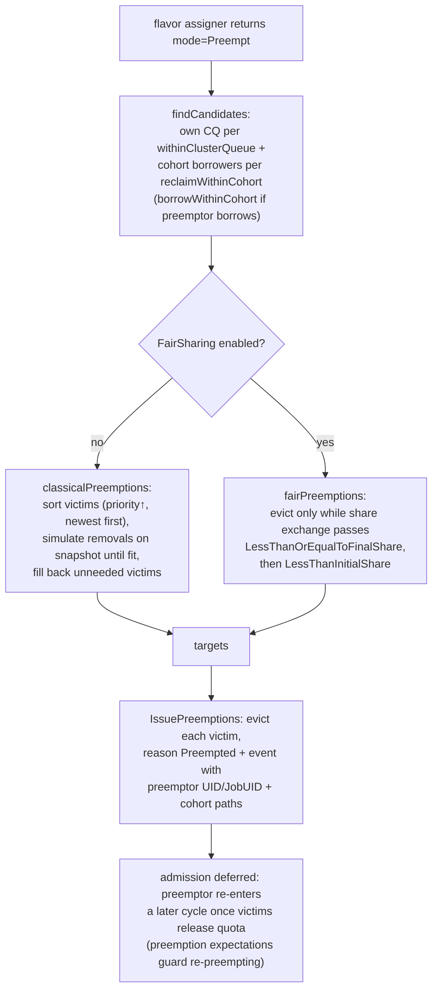

<!-- Written from a read of the source around the v0.19 cut. Links point at main (not a pinned commit), so files/directories stay resolvable as the code evolves; described behavior may drift in detail over time -- if something looks off, a fix or a removal is equally welcome, no need to reconcile the whole page. -->

Packages: [`pkg/scheduler/preemption/`](https://github.com/kubernetes-sigs/kueue/tree/main/pkg/scheduler/preemption) (+ `fairsharing/` inside it), share math in [`pkg/cache/scheduler/fair_sharing.go`](https://github.com/kubernetes-sigs/kueue/blob/main/pkg/cache/scheduler/fair_sharing.go). Entered whenever the flavor assigner returns `Preempt` mode.

## 5.1 The two-step API

`Preemptor` (preemption.go:60) exposes:

1. **`GetTargets(log, wl, assignment, snapshot)`** — pure computation on the snapshot: which admitted workloads must go so `wl` fits.
2. **`IssuePreemptions(...)`** (preemption.go:194) — side effects: for each target, evict via the shared eviction path with reason `Preempted`, emit the `Preempted` event on the victim (message built by `preemptionMessage`, preemption.go:172 — the exact format documented in the `kueue-who-preempted` runbook: preemptor UID/JobUID, both cohort paths, effective priorities including boost).

The scheduler holds admission of the preemptor until victims are actually gone (it re-encounters the workload in a later cycle once quota frees; `SchedulerTimestampPreemptionBuffer` and preemption *expectations* — `expectations.Store` — prevent it from re-preempting or double-admitting while evictions are in flight).

## 5.2 Who is a candidate? The three policy dials

`ClusterQueue.spec.preemption` (clusterqueue_types.go:516+):

| Field | Question it answers | Values |
|---|---|---|
| `withinClusterQueue` | may I evict workloads in **my own** CQ? | `Never`, `LowerPriority`, `LowerOrNewerEqualPriority` |
| `reclaimWithinCohort` | may I evict **other CQs'** workloads that are borrowing *my* unused nominal quota? | `Never`, `LowerPriority`, `Any` |
| `borrowWithinCohort` | may I preempt in the cohort **while myself borrowing**? (restricted; interacts with priority thresholds) | policy + `maxPriorityThreshold` |

`findCandidatesForPolicy` / `findCandidates` (preemption.go:558+) gather admitted workloads from the CQ and cohort that match these dials and touch the flavor-resources needing preemption (`flavorResourcesNeedPreemption`).

## 5.3 Classical preemption

`classicalPreemptions` (preemption.go:277) sorts candidates (lowest priority / newest first, respecting `PrioritySortingWithinCohort`), then greedily simulates on the snapshot: remove candidate → `workloadFits`? Repeat until it fits, then **fill back** (`fillBackWorkloads`, preemption.go:334) any candidate whose removal turned out unnecessary — producing a minimal victim set. Everything runs on snapshot simulation with `restoreSnapshot` between attempts (Chapter 3.3).

## 5.4 Fair Sharing (KEP-1714 + KEP-4136)

With `fairSharing.enable` in the configuration, both *admission order* and *preemption* switch to share-based logic:

- **DRS — dominant resource share** ([`pkg/cache/scheduler/fair_sharing.go`](https://github.com/kubernetes-sigs/kueue/blob/main/pkg/cache/scheduler/fair_sharing.go)): for each CQ/cohort node, `max over resources (usage above nominal ÷ lendable capacity in the cohort)`, divided by the node's `.spec.fairSharing.weight`. Zero weight ⇒ infinite share (always the first preemption victim). The admission iterator ([`fair_sharing_iterator.go`](https://github.com/kubernetes-sigs/kueue/blob/main/pkg/scheduler/fair_sharing_iterator.go)) admits the entry whose CQ has the *lowest* share, recomputing as usage is assumed.
- **Preemption strategies** (config `fairSharing.preemptionStrategies`, parsed at preemption.go:358): default `[LessThanOrEqualToFinalShare, LessThanInitialShare]`. In plain words: evict a candidate only if, after the exchange, the preemptor's share stays ≤ the victim's CQ share (first strategy), falling back to the stricter "preemptor's new share < victim's share before any eviction" (second). Implemented in `runFirstFsStrategy` / `runSecondFsStrategy`.
- **Admission Fair Sharing** (KEP-4136, gate `AdmissionFairSharing`) adds *historical usage* penalties per LocalQueue (tracked in [`pkg/cache/queue/afs/`](https://github.com/kubernetes-sigs/kueue/tree/main/pkg/cache/queue/afs), decayed over time) so a queue that ran a lot recently sorts later even if it's not borrowing *now*.

## 5.5 The pipeline at a glance

## 5.6 Things that look like preemption but aren't

Reuse of the eviction machinery ≠ preemption: workload-slice replacement for elastic jobs (`replaceOldWorkloadSlice`, [`pkg/scheduler/scheduler.go`](https://github.com/kubernetes-sigs/kueue/blob/main/pkg/scheduler/scheduler.go)), TAS node-failure migration (`issueMigration`, [`pkg/scheduler/scheduler.go`](https://github.com/kubernetes-sigs/kueue/blob/main/pkg/scheduler/scheduler.go)). They carry their own reasons — keep it that way (terminology review rule).

**Where you'll engage:** roadmap items "preemption cost" (KEP-7990) and MultiKueue orchestrated preemption (KEP-8303) land here; fair-sharing strategy tuning; priority boost (KEP with `PriorityBoost` gate). This package has the highest test density in the repo ([`preemption_test.go`](https://github.com/kubernetes-sigs/kueue/blob/main/pkg/scheduler/preemption/preemption_test.go), [`scheduler_fs_test.go`](https://github.com/kubernetes-sigs/kueue/blob/main/pkg/scheduler/scheduler_fs_test.go), [`scheduler_afs_test.go`](https://github.com/kubernetes-sigs/kueue/blob/main/pkg/scheduler/scheduler_afs_test.go)) — every behavioral change needs table cases across all three policy dials.
