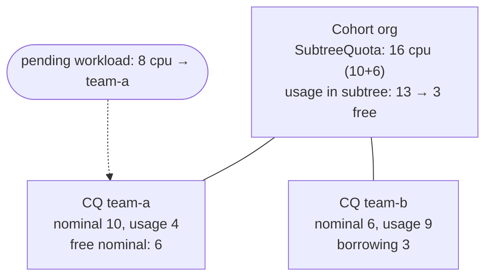

<!-- Written from a read of the source around the v0.19 cut. Links point at main (not a pinned commit), so files/directories stay resolvable as the code evolves; described behavior may drift in detail over time -- if something looks off, a fix or a removal is equally welcome, no need to reconcile the whole page. -->

Package: [`pkg/cache/scheduler/`](https://github.com/kubernetes-sigs/kueue/tree/main/pkg/cache/scheduler). The mirror image of Chapter 2: everything that *is* admitted, and how much quota it consumes, aggregated over the cohort hierarchy.

## 3.1 The live cache

`Cache` ([`cache.go`](https://github.com/kubernetes-sigs/kueue/blob/main/pkg/cache/scheduler/cache.go)) maintains, under one lock:

- `clusterQueues` — internal `clusterQueue` structs ([`clusterqueue.go`](https://github.com/kubernetes-sigs/kueue/blob/main/pkg/cache/scheduler/clusterqueue.go)) with per-flavor-resource usage, admitted workload map, flavor/check readiness (a CQ whose ResourceFlavor or AdmissionCheck doesn't exist is *inactive* and the reason is reported in the CQ status);
- the cohort hierarchy (via [`pkg/cache/hierarchy/`](https://github.com/kubernetes-sigs/kueue/tree/main/pkg/cache/hierarchy), generic parent/child plumbing reused by the queue manager too);
- the TAS cache ([`tas_cache.go`](https://github.com/kubernetes-sigs/kueue/blob/main/pkg/cache/scheduler/tas_cache.go), per-flavor node capacity — Chapter 7);
- `podsReadyCond` for the `waitForPodsReady` global gate (`WaitForPodsReady(ctx)` blocks scheduling until all admitted workloads have ready pods when `blockAdmission` is on).

The core controllers feed it: workload events → `AddOrUpdateWorkload`/`DeleteWorkload`; CQ/Cohort/RF/AC events → corresponding methods, each returning the set of ClusterQueues whose admissibility may have changed (which the controllers turn into queue-manager requeue triggers — the two caches are kept coherent *by the controllers*, not by each other).

## 3.2 The quota model: `resourceNode`

Quota math is unified for ClusterQueues and Cohorts in [`resource_node.go`](https://github.com/kubernetes-sigs/kueue/blob/main/pkg/cache/scheduler/resource_node.go):

```go
type resourceNode struct {
    Quotas       map[FlavorResource]ResourceQuota  // nominal/borrowing/lending limits at THIS node
    SubtreeQuota FlavorResourceQuantities          // own quota + children's lendable quota
    Usage        FlavorResourceQuantities          // own usage (CQ) / children's usage beyond local (Cohort)
}
```

Fitting "does this workload fit, with borrowing?" walks **up** the tree: at each ancestor, `available = SubtreeQuota − Usage` (plus lending/borrowing-limit constraints). This makes hierarchical cohorts (KEP-79) a first-class citizen: a CQ can borrow anything unused in its subtree path to the root. When you debug quota discrepancies, print `SubtreeQuota`/`Usage` at each level — [`resource_node_test.go`](https://github.com/kubernetes-sigs/kueue/blob/main/pkg/cache/scheduler/resource_node_test.go) shows the expected arithmetic.

**Worked example** (illustrative numbers). Cohort `org` with two ClusterQueues; `team-b` is already borrowing 3 CPUs; a pending 8-CPU workload arrives in `team-a`:



The walk-up: at `team-a`, 8 > 6 free nominal ⇒ needs to **borrow 2**. At `org`, subtree has 16 − 13 = 3 CPUs free ⇒ borrowing 2 fits ⇒ mode `Fit` (with borrowing). If the workload asked for 10, the cohort check would fail (10 − 6 = 4 > 3 free) and the flavor assigner would return `Preempt` — team-a is *under nominal*, so reclaiming from `team-b` (the borrower) becomes the path, subject to `reclaimWithinCohort` (Chapter 5).

## 3.3 The Snapshot

`Snapshot(ctx)` ([`snapshot.go`](https://github.com/kubernetes-sigs/kueue/blob/main/pkg/cache/scheduler/snapshot.go)) deep-copies the whole structure into `ClusterQueueSnapshot`/`CohortSnapshot` ([`clusterqueue_snapshot.go`](https://github.com/kubernetes-sigs/kueue/blob/main/pkg/cache/scheduler/clusterqueue_snapshot.go), [`cohort_snapshot.go`](https://github.com/kubernetes-sigs/kueue/blob/main/pkg/cache/scheduler/cohort_snapshot.go)). The scheduling cycle then works **only on the snapshot**:

- Nomination and preemption *simulate* on it: `SimulateWorkloadRemoval`, `AddUsage`/`removeUsage` on snapshots let the preemptor test "if I evicted these two, would the pending one fit?" without touching live state, and `restoreSnapshot` (preemption.go:349) undoes simulations between candidates.
- Fair-share values (Chapter 5) are computed on snapshot nodes.

**Rule for contributors:** cycle-scope logic must never read the live cache — only the snapshot. Mixing them causes heisenbugs under concurrent reconciles (this is exactly the class of race the maintainers' review skills warn about).

## 3.4 The assume/rollback pattern

Admission is optimistic ([`pkg/scheduler/scheduler.go`](https://github.com/kubernetes-sigs/kueue/blob/main/pkg/scheduler/scheduler.go)):

1. `assumeWorkload` writes a deep copy *with* the admission into the **live cache** (`cache.AddOrUpdateWorkload`) — quota is consumed immediately so the next cycle can't double-book it; the entry is marked `assumed`.
2. The API-server patch (`workloadpatching.PatchAdmissionStatus`) runs in a **separate goroutine** (`admissionRoutineWrapper`) so slow writes don't stall the cycle.
3. On patch failure the assumption is rolled back: `cache.DeleteWorkload` + watcher notification (+ AFS penalty reversal).

This mirrors the kube-scheduler assume/forget design. If you add state that admission consumes, it must participate in both step 1 and the rollback — a one-sided change leaks quota.

## 3.5 Metrics live here too

Per-CQ/LQ/cohort gauges ([`clusterqueue_metrics.go`](https://github.com/kubernetes-sigs/kueue/blob/main/pkg/cache/scheduler/clusterqueue_metrics.go), [`localqueue_metrics.go`](https://github.com/kubernetes-sigs/kueue/blob/main/pkg/cache/scheduler/localqueue_metrics.go), [`cohort_metrics.go`](https://github.com/kubernetes-sigs/kueue/blob/main/pkg/cache/scheduler/cohort_metrics.go)) are resynced from cache state (`Resync*GaugeMetrics`). Metric bugs ("usage gauge wrong after CQ update") are usually a missing resync call after a mutation.

**Where you'll engage:** quota semantics (lending limits, borrowing), cohort hierarchy features, snapshot performance (a hot area — snapshots are O(cluster state) every cycle), metrics. Tests: [`snapshot_test.go`](https://github.com/kubernetes-sigs/kueue/blob/main/pkg/cache/scheduler/snapshot_test.go), [`cache_test.go`](https://github.com/kubernetes-sigs/kueue/blob/main/pkg/cache/scheduler/cache_test.go), and scheduler integration suites.
