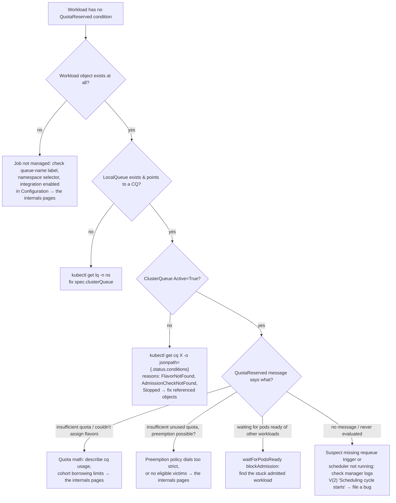
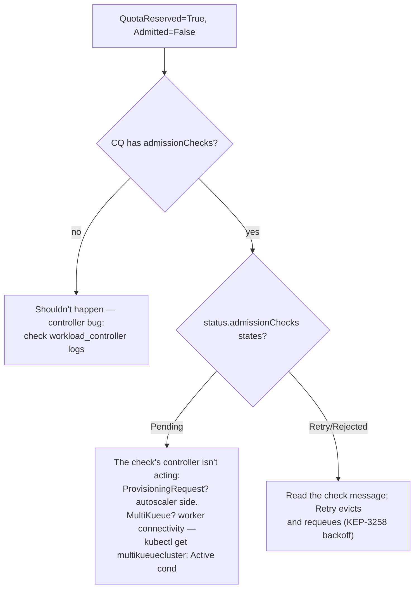
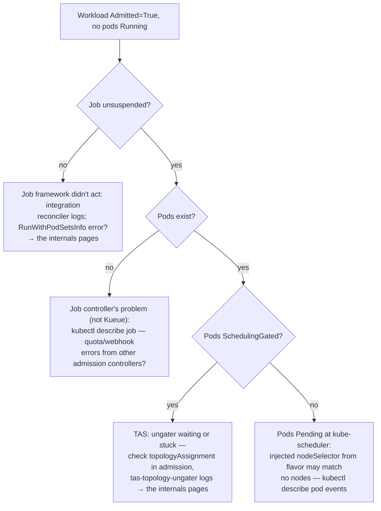
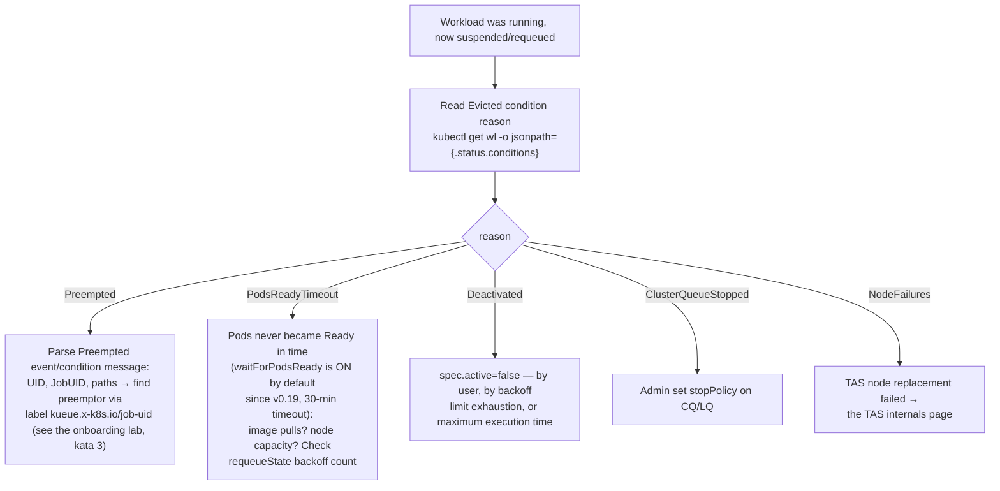

<!-- Written from a read of the source around the v0.19 cut. Links point at main (not a pinned commit), so files/directories stay resolvable as the code evolves; described behavior may drift in detail over time -- if something looks off, a fix or a removal is equally welcome, no need to reconcile the whole page. -->

Each leaf names the command to run or the subsystem (see the internals pages) to inspect. These orderings matter: queue health before quota, quota before checks.

### 3.1 Workload stuck Pending (no `QuotaReserved`)

### 3.2 `QuotaReserved` but never `Admitted`

### 3.3 Job admitted but pods not running

### 3.4 Unexpected eviction — "what killed my workload?"

